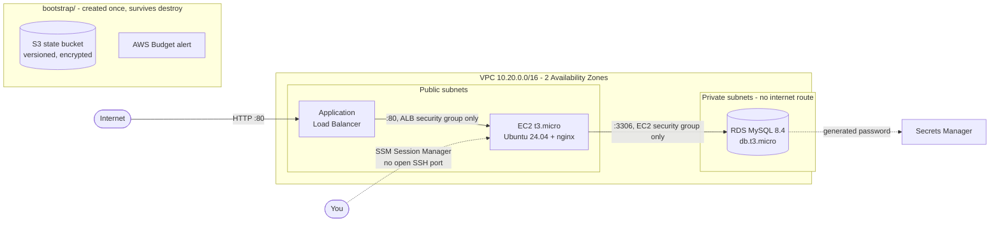

# terraform-freetier-localstack

[](https://github.com/alexiglesias/terraform-freetier-localstack/actions/workflows/ci.yml)


[](LICENSE)

A small but production-shaped AWS web stack in Terraform - VPC, EC2, ALB and
RDS - built from reusable modules and deployed to **two targets from one
codebase**: real AWS, and LocalStack for $0 local and CI testing.

The focus is on the *engineering around* the infrastructure: separate state
per environment, a hardened remote backend, secure defaults, cost guard-rails,
automated tests and a CI pipeline that deploys and destroys the stack on every
pull request.

---

## Architecture



Each security group only accepts traffic from the layer in front of it:
internet -> ALB -> EC2 -> RDS. The database has no public IP and no route to
the internet.

## What this project demonstrates

- **Reusable modules** (`network`, `compute`, `alb`, `database`), each owning its own security group
- **Isolated environments** - `envs/aws` and `envs/localstack` are separate Terraform roots with separate state, so a LocalStack run can never touch real AWS state
- **Remote state done properly** - S3 backend with native state locking (`use_lockfile`, no DynamoDB), versioning, encryption, TLS-only bucket policy, created by its own `bootstrap/` root
- **Secure defaults** - no SSH (SSM Session Manager instead), IMDSv2 enforced, encrypted disks and database, RDS-generated password stored in Secrets Manager (never in code or state), least-privilege security groups, the VPC default security group stripped of all rules
- **Guard-rails** - `allowed_account_ids` stops Terraform touching the wrong AWS account; input validation rejects things like SSH from `0.0.0.0/0`; a budget alert keeps watching even after `destroy`
- **Testing** - 14 `terraform test` unit tests with mock providers, `tflint` (incl. AWS rules), `checkov` security + secret scanning, `shellcheck`
- **CI/CD** - GitHub Actions runs every check on each PR, then deploys the stack to LocalStack, verifies a second apply is a no-op (idempotency), and destroys it. `main` is protected: nothing merges without green CI
- **Safe workflow** - one `make` entry point; you confirm *after* seeing the plan and Terraform applies exactly that saved plan

## Two targets, one codebase

| | `envs/aws` - real AWS | `envs/localstack` - LocalStack |
|---|---|---|
| VPC, subnets, routing, security groups | yes | yes |
| EC2 + SSM role | yes | yes (EC2 emulated, no SSM) |
| Application Load Balancer | yes (`create_alb`) | - not in the free LocalStack plan |
| RDS MySQL | yes (`create_rds`) | - not in the free LocalStack plan |
| State | S3 backend (`bootstrap/`) | local file |
| Cost | ~$0.07/hour while deployed | $0 |
| Verified by | validate, tflint, checkov and unit tests in CI; `make plan ENV=aws` previews it for free | CI: apply -> no-op apply -> destroy on every PR |

## Repository layout

```
.
├── bootstrap/            # run once: S3 state bucket + budget alert (local state)
├── modules/
│   ├── network/          # VPC, public/private subnets per AZ, IGW, optional NAT
│   ├── compute/          # EC2, AMI lookup, SSM role, optional SSH, security group
│   ├── alb/              # load balancer, target group, ALB -> EC2 rule
│   └── database/         # RDS MySQL, subnet group, EC2 -> RDS rule
│       └── tests/        # each module has terraform test files
├── envs/
│   ├── aws/              # real AWS root (S3 backend)
│   └── localstack/       # LocalStack root (local state)
├── scripts/
│   ├── tf.sh             # plan/apply/destroy with confirmation + account guard
│   ├── localstack-up.sh  # start LocalStack and wait until healthy
│   └── cleanup-aws.sh    # emergency: remove anything billable, even without state
├── docker-compose.yml    # pinned LocalStack image
├── Makefile              # the front door - run `make` to see every target
└── .github/workflows/    # CI
```

## Quick start - LocalStack ($0)

Needs: Terraform 1.16 (see `.terraform-version`), Docker, and a free
[LocalStack](https://app.localstack.cloud) Hobby account for the auth token.

```bash
cp .env.example .env          # paste your LOCALSTACK_AUTH_TOKEN into .env
make apply                    # starts LocalStack, shows the plan, asks, applies
make output
make destroy
make down                     # stop LocalStack
```

`ENV` defaults to `localstack`, so a plain `make apply` can never reach real AWS.

## Real AWS

Uses short-lived credentials from IAM Identity Center (SSO) - no long-lived
access keys.

```bash
aws sso login --profile <your-profile> && export AWS_PROFILE=<your-profile>

# 1. Once: state bucket + budget alert (~$0/month)
cp bootstrap/terraform.tfvars.example bootstrap/terraform.tfvars   # account id + email
terraform -chdir=bootstrap init && terraform -chdir=bootstrap apply

# 2. Configure the environment
cp envs/aws/terraform.tfvars.example envs/aws/terraform.tfvars     # account id

# 3. Free, read-only: see exactly what would be created
make plan ENV=aws

# 4. Costs money while it runs - destroy when done
make apply ENV=aws
make destroy ENV=aws
```

## Make targets

| Target | What it does | Cost |
|---|---|---|
| `make plan [ENV=aws]` | Show what would change; changes nothing | $0 |
| `make apply [ENV=aws]` | Plan -> confirm -> apply that exact plan | LocalStack $0 / AWS ~$0.07/h |
| `make destroy [ENV=aws]` | Plan destroy -> confirm -> apply | $0 |
| `make output [ENV=aws]` | Show outputs (URL, SSM command, ...) | $0 |
| `make up` / `make down` | Start / stop LocalStack | $0 |
| `make check` | `fmt` + `validate` on every root | $0 |
| `make lint` | tflint with AWS rules | $0 |
| `make security` | checkov security + secrets scan | $0 |
| `make test` | 14 module unit tests (mock providers, offline) | $0 |
| `make ci` | Everything CI runs | $0 |
| `make cleanup` | Emergency: remove everything billable this project left in AWS | $0 |

## Quality gates

| Where | What runs |
|---|---|
| Every `git commit` (pre-commit) | fmt, validate, tflint, shellcheck, private-key / AWS-key detection |
| Every pull request (GitHub Actions) | all of the above + 14 unit tests + checkov, then LocalStack apply -> no-op apply -> destroy |
| `main` branch | protected - changes only via PR with green CI |
| Weekly (Dependabot) | PRs for new GitHub Actions and provider versions, tested by CI |

### Security scan exceptions

checkov reports **0 failed checks**. A few checks are deliberately skipped,
each with its reason written inline next to the resource
(`# checkov:skip=<ID>:<reason>`), never in a global ignore list. They fall
into three groups:

- **Would cost money** in a cost-capped lab - WAF, Multi-AZ RDS, VPC flow logs, enhanced monitoring, a customer-managed KMS key, cross-region replication
- **Need a domain name** - HTTPS listener and HTTP -> HTTPS redirect (no domain in this lab)
- **Would block `make destroy`** - deletion protection on the ALB and RDS

## Cost and safety

Real AWS is opt-in, and every billable step is guarded:

| Running in AWS | Approx. cost (us-east-1) |
|---|---|
| EC2 t3.micro | $0.010 / h |
| RDS db.t3.micro + 20 GB gp3 | $0.020 / h |
| Application Load Balancer | $0.023 / h + usage |
| 3 public IPv4 addresses | $0.015 / h |
| **Whole stack** | **~$0.07 / h (~$1.60 / day)** |
| `bootstrap/` (state bucket + budget) | ~$0 / month |

- `make apply ENV=aws` prints the running cost and reminds you to destroy
- An AWS Budget emails at 80% and 100% of a monthly limit, and on the forecast
- `make cleanup` finds and removes billable leftovers by tag, even if Terraform state is lost
- MySQL 8.4 with Extended Support auto-enrolment disabled, so the database can never silently start billing for an out-of-support version
- t3.micro is Free Tier eligible for both pre- and post-July-2025 AWS accounts

## Verification

- **LocalStack** - deployed, re-applied (no changes) and destroyed by CI on every pull request; see the [Actions tab](https://github.com/alexiglesias/terraform-freetier-localstack/actions)
- **Real AWS** - the `bootstrap/` stack (state bucket + budget alert) runs in a real account. The full `envs/aws` stack is not left deployed, to keep the lab at $0: it is validated, linted, security-scanned and unit-tested on every PR, and `make plan ENV=aws` shows exactly what it would create without creating anything
- **Modules** - 14 unit tests assert the secure defaults and that bad input is rejected (e.g. MySQL 8.0, SSH from anywhere, a single-AZ ALB)

## Design decisions

- **Separate roots instead of workspaces** - each environment has its own backend and provider config, so it's impossible to point LocalStack at the AWS state by accident
- **EC2 in a public subnet** - a NAT Gateway (~$32/month) would be needed for a private instance; the module supports it (`enable_nat_gateway`) but it's off by default
- **Security group rules as separate resources** - lets the ALB module add its own rule to the instance's security group, so that rule exists only when the ALB does
- **SSM instead of SSH** - no open port and no key to leak; SSH can still be enabled for a single `/32`
- **Mock EC2 in LocalStack (`EC2_VM_MANAGER=mock`)** - fast and deterministic for CI; switch to `docker` to run real containers

## Possible next steps

- HTTPS with a domain, ACM certificate and HTTP -> HTTPS redirect
- `terraform plan` against real AWS in CI via GitHub OIDC (no stored credentials)
- Auto Scaling Group behind the ALB instead of a single instance

## License

[MIT](LICENSE)
