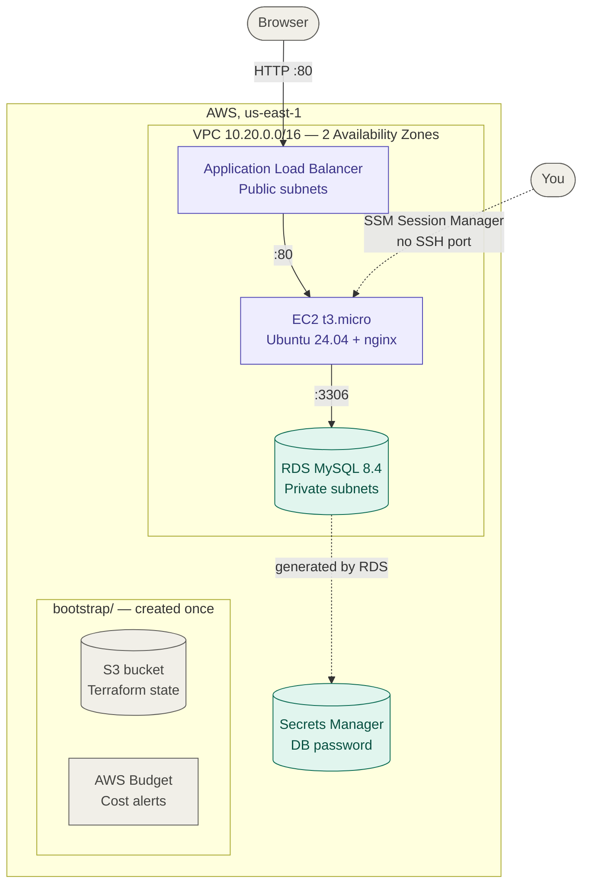

# terraform free tier + localstack

> A small, production-shaped AWS web stack — VPC, EC2, load balancer and RDS — written as Terraform modules and deployed to two targets from one codebase: real AWS, and LocalStack for $0 local and CI testing.

[](https://github.com/alexiglesias/terraform-freetier-localstack/actions/workflows/ci.yml)
[](https://developer.hashicorp.com/terraform)
[](https://registry.terraform.io/providers/hashicorp/aws/latest)
[](https://www.localstack.cloud/)
[](https://github.com/terraform-linters/tflint)
[](https://www.checkov.io/)
[](./LICENSE)

## What's in here

The earlier AWS projects ([aws-lift-and-shift](https://github.com/alexiglesias/aws-lift-and-shift), [aws-rearchitect](https://github.com/alexiglesias/aws-rearchitect)) build their infrastructure step by step with the AWS CLI and Bash. This project describes infrastructure **as code** instead: you declare what should exist, and Terraform works out how to create, change or delete it.

The stack is a classic three-tier web setup: a load balancer in front of an nginx instance, and a MySQL database the instance can reach but the internet can't. It is split into four reusable modules (`network`, `compute`, `alb`, `database`) and deployed to two environments:

1. **`envs/localstack`** runs the network and the instance on LocalStack, an AWS emulator in Docker. It costs nothing, and CI deploys and destroys it on every pull request.
2. **`envs/aws`** is the full stack on a real AWS account, with its state in an S3 bucket created by a separate `bootstrap/` step.

The two environments have separate state, so a LocalStack run can never touch the real AWS state. Everything goes through one `make` entry point, which shows the plan first and then applies exactly what you approved.

## Requirements

> **Only `envs/aws` creates billable resources** — roughly $0.07 per hour while it is deployed (see [Cost](#cost)). LocalStack, the tests and CI need no AWS account at all.

- [Terraform](https://developer.hashicorp.com/terraform/install) 1.16 — the exact version is pinned in `.terraform-version` (works with `tfenv`).
- [Docker](https://www.docker.com/products/docker-desktop/) and a free [LocalStack](https://app.localstack.cloud) Hobby account for the auth token, for the LocalStack environment.
- For the quality checks: `brew install tflint checkov pre-commit shellcheck`.
- For real AWS only: the [AWS CLI v2](https://docs.aws.amazon.com/cli/latest/userguide/getting-started-install.html), signed in with short-lived credentials from IAM Identity Center (`aws sso login --profile <profile>`), with permissions for VPC, EC2, IAM, ELB, RDS, S3 and Budgets. `make` checks which account you're signed in to before doing anything.

## Architecture



Each layer only accepts traffic from the layer in front of it. The database has no public IP and its subnets have no route to the internet:

```
internet ──80──▶ alb-sg ──80──▶ ec2-sg ──3306──▶ rds-sg
SSH is closed by default; shell access is through SSM Session Manager.
```

LocalStack's free plan doesn't include load balancers or RDS, so `envs/localstack` deploys the VPC, subnets, routing, security groups and the EC2 instance.

## Quick start

**1. LocalStack ($0).** Docker must be running.

```bash
cp .env.example .env     # paste your LOCALSTACK_AUTH_TOKEN into .env
make apply               # starts LocalStack, shows the plan, asks, applies
make output
make destroy
make down                # stop LocalStack
```

`ENV` defaults to `localstack`, so a plain `make apply` can never reach real AWS.

**2. Real AWS (optional, billable).** The bootstrap is a one-time step and costs about $0 a month.

```bash
aws sso login --profile <profile> && export AWS_PROFILE=<profile>

cp bootstrap/terraform.tfvars.example bootstrap/terraform.tfvars   # account id + alert email
terraform -chdir=bootstrap init && terraform -chdir=bootstrap apply

cp envs/aws/terraform.tfvars.example envs/aws/terraform.tfvars     # account id
make plan ENV=aws        # free and read-only: shows exactly what would be created
make apply ENV=aws       # ~$0.07/hour from here on
```

**3. Tear down.** Do this as soon as you're done.

```bash
make destroy ENV=aws     # removes the stack; the state bucket and budget stay (~$0)
make cleanup             # emergency: finds billable leftovers by tag, even without state
```

## The make targets

| Target | What it does |
|---|---|
| `make plan [ENV=aws]` | Shows what would change, changes nothing. Free even on AWS |
| `make apply [ENV=aws]` | Plan → confirm → apply that exact saved plan. On AWS it checks the account and prints the running cost |
| `make destroy [ENV=aws]` | Plan destroy → confirm → apply that exact plan |
| `make output [ENV=aws]` | Shows the outputs: site URL, SSM command, database endpoint |
| `make up` / `make down` | Starts / stops LocalStack |
| `make check` | `terraform fmt` + `validate` on every root, offline |
| `make lint` | tflint, including the AWS rules |
| `make security` | checkov security and leaked-secrets scan |
| `make test` | 14 module unit tests with mock providers, offline |
| `make ci` | Everything CI runs, in order |
| `make cleanup` | Emergency removal of everything billable this project left in AWS |

The targets are thin wrappers around three scripts:

| Script | What it does |
|---|---|
| `scripts/tf.sh` | Runs plan/apply/destroy for one environment. You confirm after seeing the plan, and Terraform applies the saved plan file. On AWS it refuses to run unless you're signed in to the account pinned in `terraform.tfvars`. `--yes` or `CI=true` for pipelines |
| `scripts/localstack-up.sh` | Starts LocalStack from `docker-compose.yml` and waits until it's healthy; stops early if Docker isn't running or the token is missing |
| `scripts/cleanup-aws.sh` | Runs `terraform destroy`, then sweeps load balancers, RDS, EC2, NAT gateways and Elastic IPs tagged with the project. `--dry-run` shows what it would delete |

### Secure defaults

- **No SSH.** Shell access is through SSM Session Manager. SSH can be enabled for a single IP, and validation rejects anything wider than a /16.
- **IMDSv2 required** on the instance, and **encrypted gp3** disks.
- **The database password is generated by RDS** and kept in Secrets Manager. It never appears in code, variables or Terraform state.
- **MySQL 8.4** with RDS Extended Support auto-enrolment disabled, so an out-of-support version can never start billing silently.
- **Least-privilege security groups**, and the VPC's default security group is stripped of all rules.
- **Hardened state bucket**: versioned, encrypted, public access blocked, HTTPS-only, with S3-native state locking (no DynamoDB table).

## Cost

Approximate on-demand prices in us-east-1 while `envs/aws` is deployed:

| Resource | Approx. per hour | Notes |
|---|---|---|
| RDS `db.t3.micro` | ~$0.020 | Including 20 GB gp3 storage |
| Application Load Balancer | ~$0.023 | Plus a small per-usage charge |
| Public IPv4 addresses | $0.005 each | The instance and the load balancer use three |
| EC2 `t3.micro` | ~$0.010 | Free Tier eligible on old and new accounts |
| NAT Gateway | ~$0.045 | Off by default (`enable_nat_gateway`) |
| S3 state bucket, Budget, Secrets Manager, IAM, security groups | ~$0 | Within free allowances at this scale |

That's roughly **$0.07 per hour**, so a test session costs a few cents. Left running, it would be around $50 a month. Prices change; check the AWS pricing pages before relying on these figures. AWS accounts created on or after 15 July 2025 get a credit-based Free Plan instead of the older 12-month Free Tier.

An AWS Budget emails you at 80% and 100% of a monthly limit ($5 by default), and on the forecast. It lives in `bootstrap/`, so it keeps watching after `make destroy`. To confirm nothing is left running:

```bash
scripts/cleanup-aws.sh --dry-run    # lists anything billable, deletes nothing
```

## How it's tested

- **`make test`** runs 14 `terraform test` unit tests with mock providers: no AWS account, no LocalStack, no cost. They check the secure defaults (IMDSv2, encryption, SSH off, MySQL 8.4, private database) and that bad input is rejected (SSH from `0.0.0.0/0`, a single-AZ load balancer, an oversized disk).
- **tflint** with the AWS ruleset, and **checkov** for security misconfigurations and leaked secrets. checkov reports 0 failed checks. The few deliberate exceptions are skipped inline, next to the resource, each with its reason; they're things that cost money (WAF, Multi-AZ, flow logs), need a domain (HTTPS) or would block `make destroy` (deletion protection).
- **GitHub Actions** runs all of the above on every pull request, then deploys `envs/localstack` to LocalStack, checks that a second apply changes nothing, and destroys it. `main` only accepts changes through a pull request with green CI, and Dependabot proposes version updates weekly.
- **pre-commit** runs fmt, validate, tflint, shellcheck and secret detection on every commit.
- **On real AWS**, the `bootstrap/` stack runs in a live account. The full `envs/aws` stack isn't left deployed, to keep the lab at $0; `make plan ENV=aws` shows exactly what it would create.

## Troubleshooting

| Symptom | Likely cause |
|---|---|
| `Docker is installed but not running` | Start Docker Desktop: `open -a Docker` |
| `LOCALSTACK_AUTH_TOKEN is not set` | Copy `.env.example` to `.env` and paste your token from app.localstack.cloud |
| `Not logged in to AWS` / `ExpiredToken` | The SSO session expired: `aws sso login --profile <profile>` |
| `Logged in to account X, but terraform.tfvars pins Y` | Wrong `AWS_PROFILE` — the guard stopped Terraform before it touched the wrong account |
| `backend.hcl not found` | Run the bootstrap first; it generates `envs/aws/backend.hcl` |
| `no space left on device` during `terraform init` | Each folder downloads its own ~700 MB AWS provider. Enable the shared cache: add `plugin_cache_dir = "$HOME/.terraform.d/plugin-cache"` to `~/.terraformrc` |
| Warning `Most Recent Image Not Filtered` on LocalStack | Expected: LocalStack has no official Canonical images, so `envs/localstack` picks its emulated Ubuntu image |
| `missing separator` from `make` | The Makefile lost its tab characters, usually from copy-pasting. Restore it from Git |

## Project structure

```
terraform-freetier-localstack/
├── .github/
│   ├── workflows/ci.yml        # lint, security, unit tests, LocalStack deploy + destroy
│   └── dependabot.yml          # weekly version updates
├── bootstrap/                  # one-time: S3 state bucket + budget alert (local state)
├── envs/
│   ├── aws/                    # real AWS root, S3 backend
│   └── localstack/             # LocalStack root, local state
├── modules/
│   ├── network/                # VPC, public/private subnets per AZ, optional NAT
│   ├── compute/                # EC2, SSM role, optional SSH, security group
│   ├── alb/                    # load balancer, target group, ALB → EC2 rule
│   └── database/               # RDS MySQL, subnet group, EC2 → RDS rule
│       └── tests/              # every module has terraform test files
├── scripts/
│   ├── tf.sh                   # plan / apply / destroy with confirmation + account guard
│   ├── localstack-up.sh        # start LocalStack and wait until healthy
│   └── cleanup-aws.sh          # emergency sweep of billable leftovers
├── docker-compose.yml          # pinned LocalStack image
├── Makefile                    # run `make` to list every target
├── .tflint.hcl  .checkov.yaml  .pre-commit-config.yaml
└── .terraform-version          # pinned Terraform version
```

## License

[MIT](./LICENSE)
